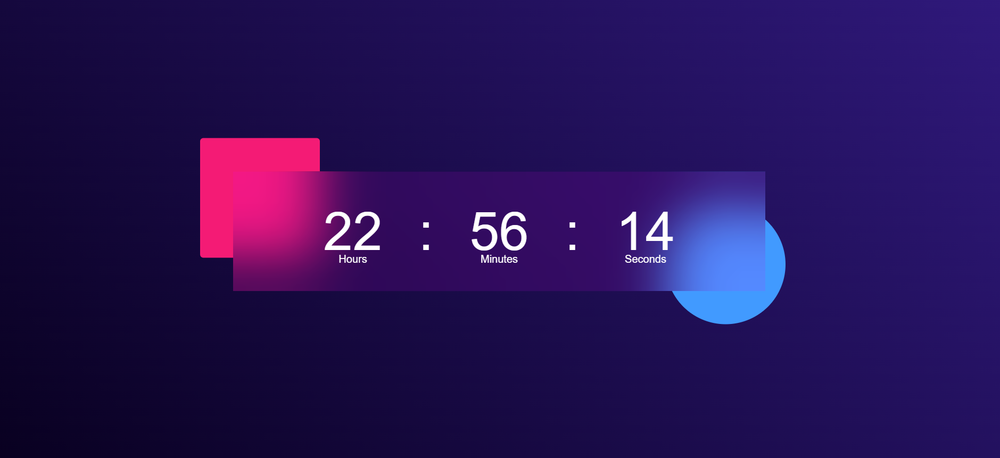

# 🕒 Real-Time Clock

A simple, real-time digital clock built using **HTML** and **CSS**. This project displays the current time and updates every second using your system's local time.

---

## ✨ Features

- Displays current hours, minutes, and seconds
- 100% responsive and works across all screen sizes
- Clean and modern UI design
- Built using HTML and CSS extended with JavaScript for dynamic time updates.

---

## 🛠 Technologies Used

- HTML5
- CSS3

## 📸 Screenshot

